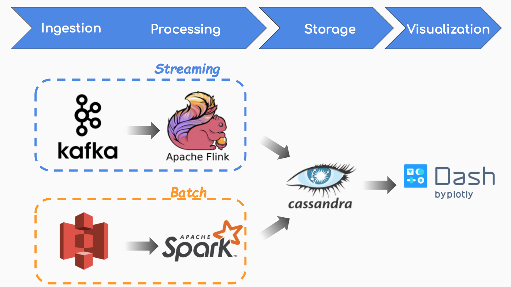

# Wiki-Guardian:  *"Catch every Anomaly for you"*

Insight 2018 Data Engineering Project

## Project Summary:

This data pipeline is designed and implemented for real-time detection of user anomaly in streaming Wikipedia edit log.

[Project Slides] (http://bit.ly/wikiguardianslides)

[Project Slides]: http://bit.ly/wikiguardianslides	"Project Slides"
[Project Video]: http://bit.ly/wikiguardianyoutubedemo	"Project Video"

## Project Description:

Changing and editing on existing topics are extrem common and quite often, especially from core group of user who like to engage more. This project aims to provide an analytic tool for wikipedia to ingest the core user behavier and suggest peer-review candidates for submitted revision.

#### Use Case:

1. Monitor the edits submission received by server:
   1. Monitor trend of total submission to identify unexpected usage across all servers
2. Abnomal user edits detection:
   1. Identify the users who submitted too many edits within a short time window
   2. Extract the recent activity for this user from database to display

#### Data Pipeline:

This anomaly detection pipeline has two branches for streaming processing and batch processing:

1. **For steaming processing part:** 

   1. Kafka ingests streaming Wikipedia input data and sends to Flink for processing. 
   2. Flink aggregates the submitted edits in defined time window from the same user.
   3. Flink compares every result to threshold table which is generated by batch processing, to determine if it is anomaly usage from this user.
   4. Processed data are saved to different tables in Cassandra with designed schema.

2. **For batch processing part,** 

   1. Spark read the history data of Wikipedia from AWS S3
   2. The average submitted edits for each user are calculated and saved to Cassandra as the threshold table for anomaly determination

3. **UI provides real-time monitor on the results in three windows:**

   1. TOP WINDOW: total submitted edits to Wikipedia
   2. BOTTOM-LEFT WINDOW: Latest 5 users flagged as 'malicious user'
   3. BOTTOM-RIGHT WINDOW: Recent activities of the latest user

   

   

## Live Demo

## Architecture

## Project Challenge: 

The chanllenges I had in this project are mainly from the question: How to make the detection method more ACCURATE and EFFICIENT? 

Other chanllenges: 

1. Completed the whole project from idea to UI in relative short time frame (four weeks!)

2. Learnt Scala from scratch to implement batch process in Spark

   

## Input Data:

1. The wikipedia edit log contains fields: `REVISION`,  `article_id`, `rev_id`,  `article_title`, `timestamp`,  `username`,  `user_id`. An example is shown below:
   > REVISION 4781981 72390319 Steven_Strogatz 2006-08-28T14:11:16Z SmackBot 433328 

   

2. The uncompressed dataset is about several TB which can be downloaded from [wikipedia site](https://en.wikipedia.org/wiki/Wikipedia:Database_download);

   

## Version:

1. Kafka: 1.0.0
2. Flink: 1.4.0
3. Spark: 2.2.1
4. Cassandra: 3.11.2
5. Dash: 0.21.1
6. Hadoop: 2.7.6
7. Zookeeper: 3.4.10

